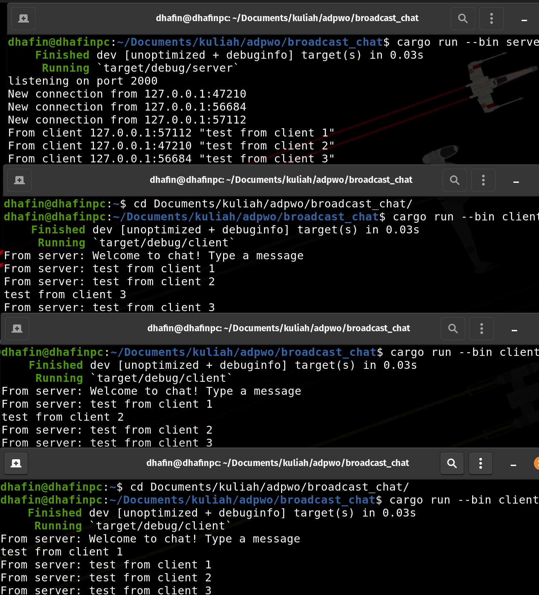
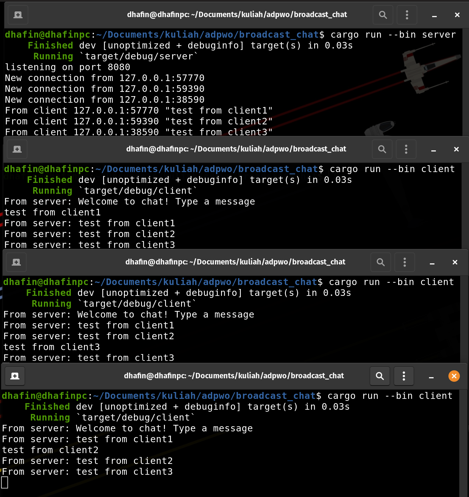
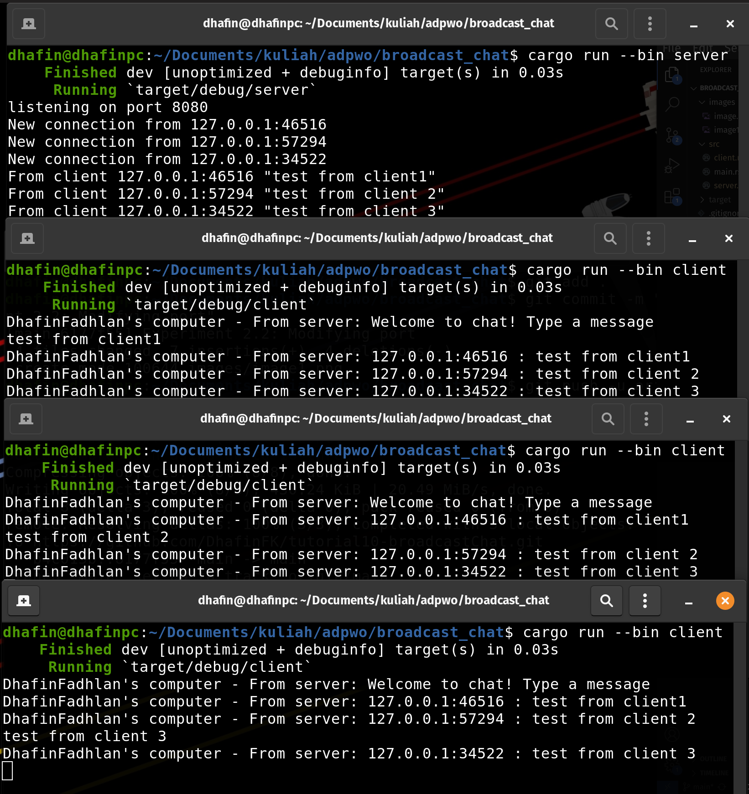

### 2.1
This Rust broadcast chat application consists of a server and clients communicating over WebSockets. The server listens for TCP connections, upgrades them to WebSocket sessions, and handles messaging via a broadcast channel, allowing messages sent by one client to be received by all others. Each client, upon connecting, can send messages and receive broadcasts from the server, displaying them in real-time. The application leverages tokio for asynchronous I/O and task management, with tokio::select! enabling concurrent handling of user input and network messages. This setup ensures efficient, real-time communication across multiple clients through a central server.

### 2.2
As long as the client and server program is connected to the same port of the same machine then the program should run fine because they're all connected to the right path. But if the port is different (even though it's connecting to the same machine) there will be an error thrown which says that the client is unable to connect.

### 2.3
I added the printing of each client's ip so that we can differentiate which client is which and who sent what to the broadcast chat.